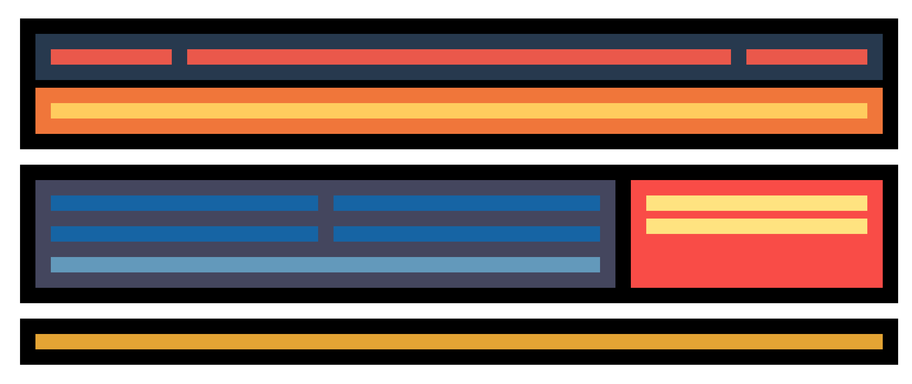

## Exercici 1

A partir del wireframe que t'aportem en format png, hauràs de fer la maquetació en format escriptori. És indiferent els colors escollits però si és molt important que facis l'estructura de caixes que t'indiquem.

L'ample màxim de la capa que contindrà tota la maquetació serà de 1200px (max-width:1200px).

## Exercici 2

Haurem de començar a preparar adaptació a diferents dispositius, pel que haurem de tenir clar el concepte de Media Query. Fixa't que hi ha canvi de distribució i color d'alguns elements.

Seguint amb el projecte anterior, fes la versió tauleta tal com indica la captura següent:

## Exercici 3

Com el cas anterior, ara hauràs de fer l'adaptació a versió Mobile.

