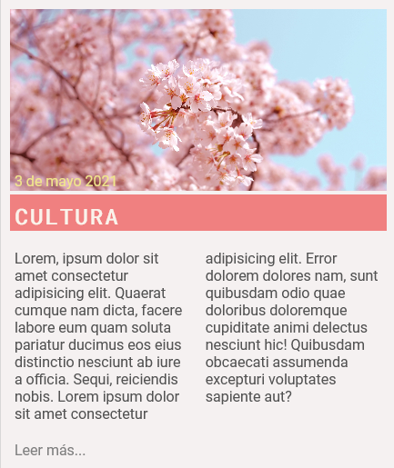

## Exercici 4

En aquesta part volem treballar la capçalera i el grafisme. Hauràs d'afegir icones i logotip, a més de fer una imatge de fons. Substitueix els quadrants respectius perquè la nova capçalera tingui l'aspecte d'aquest web de turisme al japó:

**És important que tinguis en consideració el següent:**

- Les opcions cliclables han de tenir efecte roll-over.
- Els media query creats a l'activitat anterior, s'ha de mantenir.
- El text "Disfruta..." és semitransparent.
- El logo i el fons de la capçalera, els tens adjuntat a l'activitat. La resta d'elements gràfics els hauràs de cercar i que siguin el més semblants possibles.
- Les icones del menú pots obtenir-los de font-awesome.

## Exercici 5

En aquest exercici hauràs d'afegir l'apartat dels articles seguint aquest grafisme:

